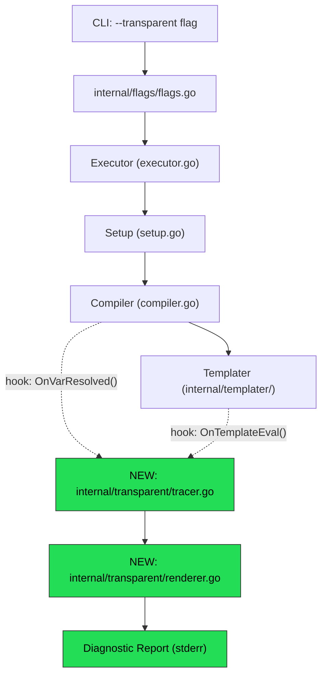
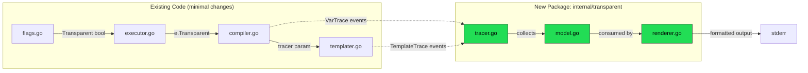
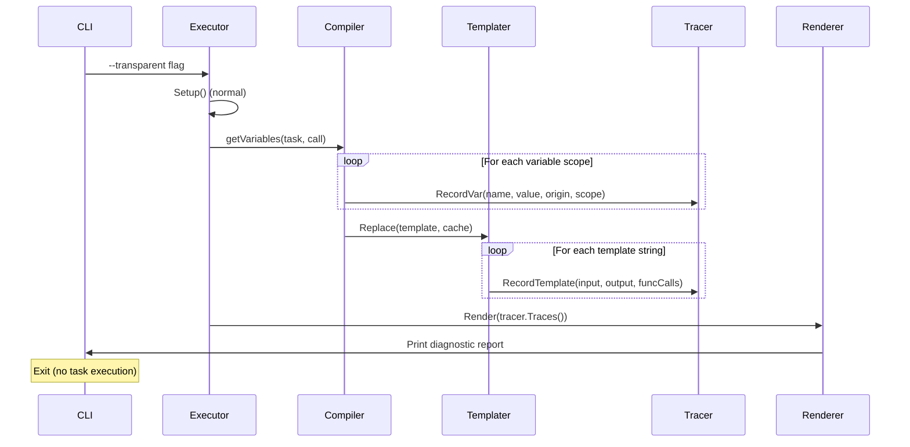

# 02 — Architecture Overview

## High-Level Design

Transparent Mode is a **compile-time-only diagnostic layer** that intercepts the variable resolution and template rendering pipeline, collects trace data, and renders a structured report. It does **not** execute any commands.

## Architecture Diagram



## Component Diagram



## Data Flow



## Design Principles

| Principle | How Applied |
|-----------|-------------|
| **S** — Single Responsibility | `Tracer` only collects; `Renderer` only formats; existing code only emits events |
| **O** — Open/Closed | New package `internal/transparent/` — no modification of core data structures |
| **L** — Liskov Substitution | Tracer is nil-safe (no-op when transparent mode off) |
| **I** — Interface Segregation | Small `Trace` interface, not a monolithic debugger |
| **D** — Dependency Inversion | Compiler/Templater depend on a `TraceCollector` interface, not the concrete tracer |

## Key Decision: Nil-Safe Tracer Pattern

The tracer is injected into `Compiler` and `templater.Cache` as an **optional pointer**. All methods on the tracer are nil-receiver safe:

```go
// All methods are no-ops when t is nil
func (t *Tracer) RecordVar(name string, v VarTrace) {
    if t == nil { return }
    // ...
}
```

This means **zero performance impact** when transparent mode is off — no interface dispatch, no allocation, just a nil pointer check.

## Extensibility Design

Transparent Mode is designed to survive future changes to Task:

### 1. New Variable Sources

When a new variable origin is added (e.g. a future `remote:` vars, `plugin:` vars, or `matrix:` vars):

- Add a new `VarOrigin` constant to `internal/transparent/model.go`
- Add one `c.Tracer.RecordVar(...)` call at the new resolution site in `compiler.go`
- The renderer automatically picks up new origins — no renderer changes needed

### 2. New Template Functions

When new functions are added to `internal/templater/funcs.go`:

- **No changes required.** Pipe analysis works from the template AST, not a hardcoded function list. Any function registered in `templateFuncs` is automatically traced.

### 3. New Task Features (e.g. new field on `ast.Task`)

When a new field is added to tasks (like `if:`, `for:`, `prompt:` were added):

- If the field uses template substitution → it's automatically traced via `templater.Replace()`
- If it introduces new variable scoping → add a `RecordVar()` call with a new origin

### 4. Plugin/Extension Metadata

The `VarTrace.Extra map[string]any` field is reserved for future use:
- IDE plugins can attach source location info
- Remote taskfile features can attach URL/cache metadata
- Custom renderers can attach rendering hints

### 5. New Output Formats

The renderer is format-agnostic. To add a new output format:
- Implement a new `Render*()` function in `internal/transparent/`
- The `TraceReport` data structure remains the same

### 6. Copy-vs-Reference Tracking

The `VarTrace.ValueID` field uses `reflect.ValueOf().Pointer()` to track whether two variables point to the same underlying data (slices, maps). This works for any future variable type that uses reference semantics in Go.
