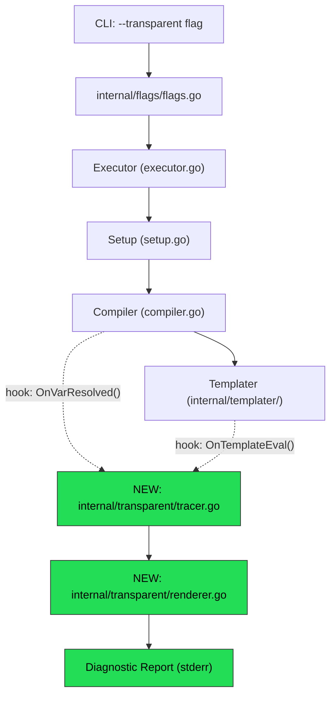
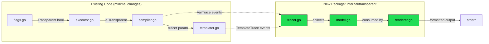
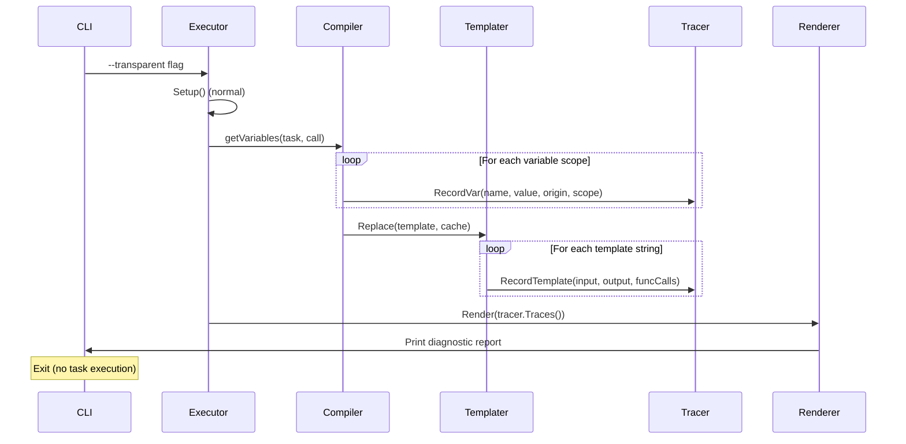

# 02 — Architecture Overview

## High-Level Design

Transparent Mode is a **compile-time-only diagnostic layer** that intercepts the variable resolution and template rendering pipeline, collects trace data, and renders a structured report. It does **not** execute any commands.

## Architecture Diagram



## Component Diagram



## Data Flow



## Design Principles

| Principle | How Applied |
|-----------|-------------|
| **S** — Single Responsibility | `Tracer` only collects; `Renderer` only formats; existing code only emits events |
| **O** — Open/Closed | New package `internal/transparent/` — no modification of core data structures |
| **L** — Liskov Substitution | Tracer is nil-safe (no-op when transparent mode off) |
| **I** — Interface Segregation | Small `Trace` interface, not a monolithic debugger |
| **D** — Dependency Inversion | Compiler/Templater depend on a `TraceCollector` interface, not the concrete tracer |

## Key Decision: Nil-Safe Tracer Pattern

The tracer is injected into `Compiler` and `templater.Cache` as an **optional pointer**. All methods on the tracer are nil-receiver safe:

```go
// All methods are no-ops when t is nil
func (t *Tracer) RecordVar(name string, v VarTrace) {
    if t == nil { return }
    // ...
}
```

This means **zero performance impact** when transparent mode is off — no interface dispatch, no allocation, just a nil pointer check.
