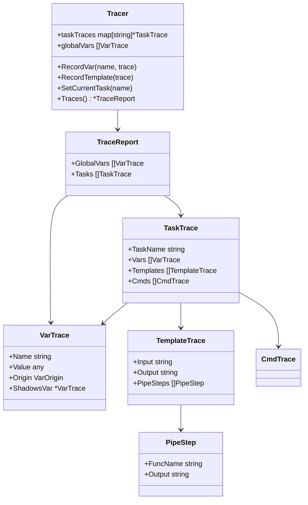

# 03 — Data Model

## Trace Structures

All types live in `internal/transparent/model.go`.

### VarTrace

Captures one variable resolution event.

```
VarTrace {
    Name       string       // "MY_VAR"
    Value      any          // resolved value
    RawValue   any          // pre-template-substitution value (if different)
    Origin     VarOrigin    // enum: see below
    Type       string       // Go type: "string", "[]string", "map[string]any"
    IsDynamic  bool         // true if resolved via `sh:`
    ShCmd      string       // shell command (if dynamic)
    Dir        string       // directory context for resolution
    ShadowsVar *VarTrace    // non-nil if this var shadows another from outer scope
    TaskName   string       // "" for global scope
}
```

### VarOrigin (enum)

```
OriginEnvironment          // os environment
OriginSpecial              // TASK, ROOT_DIR, TASK_DIR, etc.
OriginTaskfileEnv          // Taskfile.yml `env:` block
OriginTaskfileVars         // Taskfile.yml `vars:` block
OriginIncludeVars          // `includes:` directive vars
OriginIncludedTaskfileVars // vars from the included Taskfile itself
OriginCallVars             // CLI or call-site vars (FOO=bar)
OriginTaskVars             // task-level `vars:` block
OriginForLoop              // FOR loop iterator (ITEM, KEY)
OriginDotenv               // .env file
```

### TemplateTrace

Captures one template evaluation.

```
TemplateTrace {
    Input      string            // raw template: "{{printf \"%s\" .NAME | trim}}"
    Output     string            // resolved: "hello"
    Context    string            // where used: "task:build.cmds[0]"
    PipeSteps  []PipeStep        // breakdown of pipe chain
    VarsUsed   []string          // ["NAME"]
    Error      string            // template error if any
}
```

### PipeStep

Captures one step in a template pipe chain.

```
PipeStep {
    FuncName   string   // "printf", "trim"
    Args       []string // ["\"%s\"", ".NAME"]
    ArgsValues []string // ["\"%s\"", "\"hello\""] (resolved)
    Output     string   // intermediate result
}
```

### TaskTrace

Groups all traces for a single task.

```
TaskTrace {
    TaskName    string
    Vars        []VarTrace
    Templates   []TemplateTrace
    Deps        []string           // dependency task names
    Cmds        []CmdTrace
}
```

### CmdTrace

```
CmdTrace {
    Index      int
    RawCmd     string   // before template substitution
    ResolvedCmd string  // after template substitution
    Templates  []TemplateTrace
}
```

## Relationships


