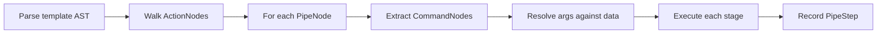

# 06 — Template Pipe Introspection

## The Problem

Go templates use Unix-style pipe chains: `{{.NAME | trim | upper}}`. Users struggle with:

1. **Evaluation order** — pipes flow left to right, but function calls like `printf` take explicit args
2. **Parenthesization** — `{{printf "%s" .NAME | trim}}` trims printf's output, NOT `.NAME`
3. **Intermediate values** — no way to see what value flows between pipe stages

## How Go Templates Evaluate Pipes

```
{{printf "%s : %s" .GREETING .NAME | trim}}
```

Evaluation:
```
1. Resolve .GREETING → "Hello"
2. Resolve .NAME → "Task"
3. Call printf("%s : %s", "Hello", "Task") → "Hello : Task"
4. Pipe result to trim("Hello : Task") → "Hello : Task"
```

If the user wanted to trim `.NAME` first:
```
{{printf "%s : %s" .GREETING (.NAME | trim)}}
```

Evaluation:
```
1. Resolve .GREETING → "Hello"
2. Resolve .NAME → "  Task  "
3. Pipe .NAME to trim("  Task  ") → "Task"
4. Call printf("%s : %s", "Hello", "Task") → "Hello : Task"
```

## Implementation Approach

### Option A: AST-level introspection (Recommended)

Use `github.com/go-task/template` (forked `text/template`) which exposes `parse.PipeNode`, `parse.CommandNode`, and `parse.ActionNode`.

**Strategy:** After parsing the template, walk the AST to extract pipe structure. For each `PipeNode`:

1. Iterate `PipeNode.Cmds` — each is a `CommandNode`
2. For each `CommandNode`, extract:
   - Function name (first `IdentifierNode`)
   - Arguments (remaining nodes: `FieldNode` for `.NAME`, `StringNode` for literals)
3. Execute the template normally for the final output
4. Re-execute each pipe stage individually for intermediate values

**File:** `internal/transparent/pipe_analyzer.go`

**Key function:** `AnalyzePipe(templateStr string, data map[string]any) []PipeStep`



### Option B: String-level heuristic parsing

Parse the `{{ }}` delimiters and split on `|`. Simpler but less accurate for nested expressions.

**Not recommended** — breaks on `{{ "hello|world" }}` and nested pipes.

### Chosen: Option A

Leverages the real template parser for correctness. The `github.com/go-task/template` package already exposes the `parse` package.

## Integration Point

**File:** `internal/templater/templater.go`

**Function:** `ReplaceWithExtra()` at line 84

**Before (current):**
```go
tpl, err := template.New("").Funcs(templateFuncs).Parse(v)
// ...
tpl.Execute(&b, data)
```

**After (with tracer):**
```go
tpl, err := template.New("").Funcs(templateFuncs).Parse(v)
// If tracer is active, analyze the AST before execution
if cache.Tracer != nil {
    cache.Tracer.RecordTemplate(analyzePipe(tpl, v, data))
}
tpl.Execute(&b, data)
```

## Available Template Functions (for reference)

Source: `internal/templater/funcs.go` + `slim-sprig`

| Category | Functions |
|----------|-----------|
| Strings | `trim`, `trimAll`, `trimSuffix`, `trimPrefix`, `upper`, `lower`, `title`, `replace`, `repeat`, `substr`, `nospace`, `abbrev`, `initials`, `contains`, `hasPrefix`, `hasSuffix`, `quote`, `squote`, `cat`, `indent`, `nindent`, `wrap`, `wrapWith` |
| Formatting | `printf`, `print`, `println` |
| Type Conv | `toString`, `toInt`, `toFloat64`, `toBool`, `toJson`, `mustToJson`, `fromJson`, `mustFromJson` |
| Lists | `list`, `first`, `last`, `rest`, `initial`, `append`, `prepend`, `concat`, `reverse`, `uniq`, `without`, `has`, `slice`, `sortAlpha` |
| Dicts | `dict`, `set`, `unset`, `hasKey`, `pluck`, `keys`, `values`, `pick`, `omit`, `merge`, `mergeOverwrite` |
| Math | `add`, `sub`, `mul`, `div`, `mod`, `max`, `min`, `ceil`, `floor`, `round` |
| Task-specific | `OS`, `ARCH`, `numCPU`, `catLines`, `splitLines`, `fromSlash`, `toSlash`, `exeExt`, `shellQuote`/`q`, `splitArgs`, `joinPath`, `relPath`, `merge`, `spew`, `fromYaml`, `toYaml`, `uuid`, `randIntN` |
