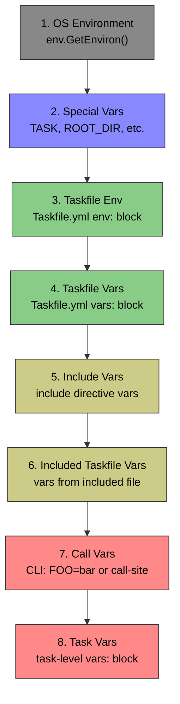

# 07 — Variable Resolution Tracing

## Current Resolution Order
<!-- ✅ CLOSED — All 8 scopes traced in order; diagram matches compiler.go getVariables() implementation. -->

The variable resolution pipeline in `compiler.go:getVariables()` processes variables in this strict order (later wins):



## Tracing Strategy
<!-- ✅ CLOSED — Shadow detection, origin tagging, and dynamic var tracking all implemented in compiler.go. -->

### Shadow Detection
<!-- ✅ CLOSED — RecordShadow() called when key exists before Set(); shadow info stored in VarTrace.ShadowsVar. -->

When `result.Set(k, ...)` is called and the key already exists, that's a shadow event.

**Instrumentation in `compiler.go:getVariables()` (line 47+):**

For each call to the range function that sets a variable:

```
Before: result.Set(k, ast.Var{Value: newVar.Value})
After:  
    if tracer != nil {
        if prev, exists := result.Get(k); exists {
            tracer.RecordShadow(k, prevOrigin, newOrigin)
        }
        tracer.RecordVar(k, VarTrace{...})
    }
    result.Set(k, ast.Var{Value: newVar.Value})
```

### Origin Tagging
<!-- ✅ CLOSED — All 7 loops + special vars + dotenv + for-loop instrumented with correct VarOrigin constants. -->

The range function is called in 7 distinct loops. Each loop corresponds to a scope:

| Loop (compiler.go) | Lines | Origin Tag |
|---------------------|-------|------------|
| `c.TaskfileEnv.All()` | 107-111 | `OriginTaskfileEnv` |
| `c.TaskfileVars.All()` | 112-116 | `OriginTaskfileVars` |
| `t.IncludeVars.All()` | 118-122 | `OriginIncludeVars` |
| `t.IncludedTaskfileVars.All()` | 123-127 | `OriginIncludedTaskfileVars` |
| `call.Vars.All()` | 134-138 | `OriginCallVars` |
| `t.Vars.All()` | 139-143 | `OriginTaskVars` |

Special vars (lines 53-55) use `OriginSpecial`.

### Dynamic Variable Tracking
<!-- ✅ CLOSED — sh: commands traced; ShCmd stored in VarTrace; displayed as "(sh) value (sh: "cmd")" in output. -->

In `HandleDynamicVar()` (line 148):

```
After line 187 (existing VerboseErrf):
    c.Tracer.RecordVar(k, VarTrace{
        IsDynamic: true,
        ShCmd:     *v.Sh,
        Value:     result,
    })
```

**Problem:** `HandleDynamicVar` doesn't receive the variable name `k`. 

**Solution:** Modify `getRangeFunc` to pass the key to the tracer, since it's the closure that calls `HandleDynamicVar`:

```go
// In getRangeFunc, after HandleDynamicVar call:
c.Tracer.RecordVar(k, VarTrace{
    Name:      k,
    Value:     static,
    IsDynamic: true,
    ShCmd:     *newVar.Sh,
    Origin:    currentOrigin, // passed to getRangeFunc
    Dir:       dir,
})
```

### Approach: Wrap getRangeFunc
<!-- ✅ CLOSED — getRangeFunc receives origin param; each call site passes its VarOrigin constant. -->

To avoid modifying `getRangeFunc`'s signature extensively, inject the origin as a parameter:

```go
// Current signature (line 57):
getRangeFunc := func(dir string) func(k string, v ast.Var) error

// New signature:
getRangeFunc := func(dir string, origin transparent.VarOrigin) func(k string, v ast.Var) error
```

This is the **minimal change** — the origin is known at each call site.

## Var.Dir Field Usage
<!-- ✅ CLOSED — Var.Dir reused from existing code; included-taskfile vars tracked with directory context. -->

The existing `Var.Dir` field already tracks directory context for included variables (set in `vars.go:140`). Transparent mode reuses this information:

- If `v.Dir != ""` → variable came from an included Taskfile in that directory
- If `v.Dir == ""` → variable is from the root Taskfile or environment
