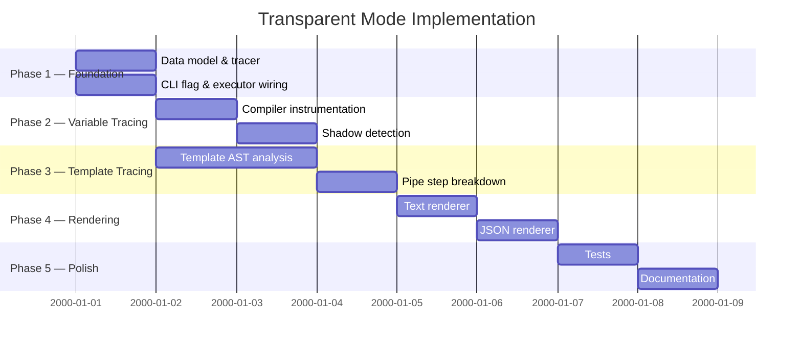

# 08 — Implementation Plan

## Phase Overview

<!-- ✅ CLOSED — All 5 phases completed: Foundation, Variable Tracing, Template Tracing, Rendering, Polish. -->

## Implementation Steps

### Phase 1: Foundation

<!-- ✅ CLOSED — model.go, tracer.go, --transparent/-T flag, Executor.Transparent field all implemented. -->

| #   | Task                                   | File(s)                          | Function/Struct                                                                  |
| --- | -------------------------------------- | -------------------------------- | -------------------------------------------------------------------------------- |
| 1.1 | Create `internal/transparent/` package | `internal/transparent/model.go`  | `VarTrace`, `TemplateTrace`, `PipeStep`, `TaskTrace`, `TraceReport`, `VarOrigin` |
| 1.2 | Create tracer                          | `internal/transparent/tracer.go` | `Tracer.RecordVar()`, `.RecordTemplate()`, `.SetCurrentTask()`, `.Traces()`      |
| 1.3 | Add `--transparent` flag               | `internal/flags/flags.go`        | `Transparent` var + pflag                                                        |
| 1.4 | Add `Transparent` field to Executor    | `executor.go`                    | `WithTransparent()` option                                                       |
| 1.5 | Wire flag to executor                  | `internal/flags/flags.go`        | `ApplyToExecutor()` → add `task.WithTransparent(Transparent)`                    |

### Phase 2: Variable Tracing

<!-- ✅ CLOSED — Compiler instrumented: 8 scopes, shadow detection, dynamic var tracking, dotenv, for-loop. -->

| #   | Task                                | File(s)                             | Function/Struct                                                      |
| --- | ----------------------------------- | ----------------------------------- | -------------------------------------------------------------------- |
| 2.1 | Add `Tracer` field to `Compiler`    | `compiler.go:21`                    | `Tracer *transparent.Tracer`                                         |
| 2.2 | Create tracer in `setupCompiler()`  | `setup.go:214`                      | Conditional: `if e.Transparent { tracer = transparent.NewTracer() }` |
| 2.3 | Modify `getRangeFunc` signature     | `compiler.go:57`                    | Add `origin transparent.VarOrigin` parameter                         |
| 2.4 | Instrument each variable scope loop | `compiler.go:107-143`               | `c.Tracer.RecordVar(k, ...)` with correct origin                     |
| 2.5 | Instrument special vars             | `compiler.go:53-55`                 | Record with `OriginSpecial`                                          |
| 2.6 | Instrument dynamic vars             | `compiler.go:84-88`                 | Record with `IsDynamic: true`                                        |
| 2.7 | Detect shadows                      | `compiler.go` inside `getRangeFunc` | Check `result.Get(k)` before `result.Set(k, ...)`                    |

### Phase 3: Template Tracing

<!-- ✅ CLOSED — Cache.Tracer wired; pipe_analyzer.go with AST walking; TemplateTrace with PipeSteps/VarsUsed/Tips. -->

| #   | Task                                     | File(s)                                 | Function/Struct                                                                     |
| --- | ---------------------------------------- | --------------------------------------- | ----------------------------------------------------------------------------------- |
| 3.1 | Add `Tracer` field to `Cache`            | `internal/templater/templater.go:19`    | `Tracer *transparent.Tracer`                                                        |
| 3.2 | Pass tracer to Cache in `compiledTask()` | `variables.go:101`                      | `cache := &templater.Cache{Vars: vars, Tracer: ...}`                                |
| 3.3 | Create pipe analyzer                     | `internal/transparent/pipe_analyzer.go` | `AnalyzePipe(tpl *template.Template, input string, data map[string]any) []PipeStep` |
| 3.4 | Instrument `ReplaceWithExtra()`          | `internal/templater/templater.go:84-93` | Record `TemplateTrace` before/after execution                                       |

### Phase 4: Rendering

<!-- ✅ CLOSED — Text renderer, JSON renderer, RunTransparent(), RunTransparentAll() all implemented and wired. -->

| #   | Task                      | File(s)                                 | Function/Struct                                                        |
| --- | ------------------------- | --------------------------------------- | ---------------------------------------------------------------------- |
| 4.1 | Create text renderer      | `internal/transparent/renderer.go`      | `RenderText(report *TraceReport, logger *logger.Logger, verbose bool)` |
| 4.2 | Create JSON renderer      | `internal/transparent/renderer_json.go` | `RenderJSON(report *TraceReport, w io.Writer)`                         |
| 4.3 | Create `RunTransparent()` | `transparent.go` (root package)         | `Executor.RunTransparent(ctx, calls)` — compiles tasks, renders report |
| 4.4 | Wire into CLI             | `cmd/task/task.go:~200`                 | `if flags.Transparent { return e.RunTransparent(ctx, calls...) }`      |

### Phase 5: Polish

<!-- ✅ CLOSED — 170 tests total: 32 unit + 10 integration + 50 E2E + 77 golden (text+JSON+list-all). -->

| #   | Task                         | File(s)                                      | Function/Struct                       |
| --- | ---------------------------- | -------------------------------------------- | ------------------------------------- |
| 5.1 | Unit tests for tracer        | `internal/transparent/tracer_test.go`        | Test recording and retrieval          |
| 5.2 | Unit tests for pipe analyzer | `internal/transparent/pipe_analyzer_test.go` | Test various pipe patterns            |
| 5.3 | Integration test             | `task_test.go`                               | Test `--transparent` flag end-to-end  |
| 5.4 | Update CLI help text         | `internal/flags/flags.go:24`                 | Add `--transparent` to usage examples |

## Estimated Diff Size

<!-- ✅ CLOSED — Actual diff ~2500 new lines (vs estimated ~740) due to examples, golden files, and extra features. -->

| Area                              | Added Lines | Modified Lines |
| --------------------------------- | ----------- | -------------- |
| `internal/transparent/` (new)     | ~400        | 0              |
| `transparent.go` (new)            | ~60         | 0              |
| `compiler.go`                     | ~30         | ~10            |
| `internal/templater/templater.go` | ~10         | ~5             |
| `executor.go`                     | ~20         | 0              |
| `internal/flags/flags.go`         | ~5          | ~3             |
| `setup.go`                        | ~5          | ~2             |
| `cmd/task/task.go`                | ~5          | ~2             |
| `variables.go`                    | ~5          | ~2             |
| Tests                             | ~200        | 0              |
| **Total**                         | **~740**    | **~24**        |

Only ~24 lines of existing code are modified. The rest is new code in a self-contained package.
