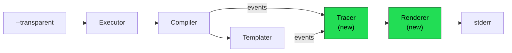

# 10 — Summary & Quick Reference

## What is Transparent Mode?

A diagnostic overlay activated via `--transparent` (`-T`) that shows:
- Every variable's resolved value, origin scope, and type
- Template expression step-by-step evaluation (pipe chains)
- Variable shadowing warnings
- Instance identity for referenced variables

It is **read-only** — no commands are executed.

## CLI Usage

```bash
# Show diagnostics for a specific task
task greet --transparent

# Show diagnostics with all variables (including special/env)
task greet --transparent -v

# JSON output for tooling
task greet --transparent --json

# Show all tasks' variable scopes
task --transparent --list-all
```

## New Files (all in `internal/transparent/`)

| File | Purpose | Key Types/Functions |
|------|---------|---------------------|
| `model.go` | Data structures | `VarTrace`, `TemplateTrace`, `PipeStep`, `TaskTrace`, `TraceReport`, `VarOrigin` |
| `tracer.go` | Event collection | `Tracer.RecordVar()`, `.RecordTemplate()`, `.SetCurrentTask()`, `.Traces()` |
| `pipe_analyzer.go` | Template AST walking | `AnalyzePipe()` |
| `renderer.go` | Text output formatting | `RenderText()` |
| `renderer_json.go` | JSON output | `RenderJSON()` |

## Root Package New File

| File | Purpose | Key Functions |
|------|---------|---------------|
| `transparent.go` | Executor integration | `Executor.RunTransparent()` |

## Modified Files (minimal changes)

| File | What Changes | Lines Changed |
|------|-------------|---------------|
| `internal/flags/flags.go` | Add `Transparent` flag + pflag + wire | ~8 |
| `executor.go` | Add `Transparent` field + `WithTransparent()` option | ~20 |
| `setup.go` | Create tracer in `setupCompiler()` | ~5 |
| `compiler.go` | Add `Tracer` field, instrument `getRangeFunc` + scope loops | ~40 |
| `internal/templater/templater.go` | Add `Tracer` field to `Cache`, instrument `ReplaceWithExtra` | ~15 |
| `variables.go` | Pass tracer to `Cache`, record `CmdTrace` | ~7 |
| `cmd/task/task.go` | Intercept before `e.Run()` for transparent mode | ~5 |

## Variable Resolution Order (for reference)

```
 Priority (lowest → highest):
 1. OS Environment
 2. Special Vars (TASK, ROOT_DIR, ...)
 3. Taskfile.yml env:
 4. Taskfile.yml vars:
 5. Include directive vars
 6. Included Taskfile vars
 7. CLI/Call-site vars
 8. Task-level vars:
```

## Architecture Diagram (Compact)



## Design Decisions

| Decision | Rationale |
|----------|-----------|
| Nil-safe tracer (not interface) | Zero overhead when off; simpler than interface dispatch |
| New package `internal/transparent/` | Isolates all new code; SOLID SRP |
| `--transparent` as standalone flag | Orthogonal to `--dry`, `--verbose`, `--summary` |
| Report to stderr | Doesn't interfere with stdout (piping, scripts) |
| AST-based pipe analysis | Correct handling of nested pipes, parenthesization |
| ~24 modified lines in existing code | Minimal risk, easy to review/revert |
