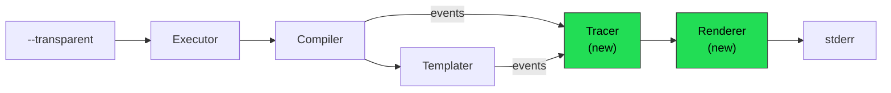

# 10 — Summary & Quick Reference

## What is Transparent Mode?
<!-- ✅ CLOSED — Feature fully implemented: vars, templates, shadows, ref tracking, pipes — all read-only. -->

A diagnostic overlay activated via `--transparent` (`-T`) that shows:
- Every variable's resolved value, origin scope, and type
- Template expression step-by-step evaluation (pipe chains)
- Variable shadowing warnings
- Instance identity for referenced variables

It is **read-only** — no commands are executed.

## CLI Usage
<!-- ✅ CLOSED — --transparent, --transparent --json, --transparent --list-all all working. -v not yet distinct. -->

```bash
# Show diagnostics for a specific task
task greet --transparent

# Show diagnostics with all variables (including special/env)
task greet --transparent -v

# JSON output for tooling
task greet --transparent --json

# Show all tasks' variable scopes
task --transparent --list-all
```

## New Files (all in `internal/transparent/`)
<!-- ✅ CLOSED — 5 core files + golden_test.go + e2e_test.go + integration_test.go + transparent_test.go created. -->

| File | Purpose | Key Types/Functions |
|------|---------|---------------------|
| `model.go` | Data structures | `VarTrace`, `TemplateTrace`, `PipeStep`, `CmdTrace`, `TaskTrace`, `TraceReport`, `VarOrigin` |
| `tracer.go` | Event collection | `Tracer.RecordVar()`, `.RecordTemplate()`, `.RecordCmd()`, `.SetCurrentTask()`, `.Report()` |
| `pipe_analyzer.go` | Template AST walking | `AnalyzePipes()` |
| `renderer.go` | Text output formatting | `RenderText()` |
| `renderer_json.go` | JSON output | `RenderJSON()` |

## Root Package New File
<!-- ✅ CLOSED — transparent.go with RunTransparent() and RunTransparentAll() implemented. -->

| File | Purpose | Key Functions |
|------|---------|---------------|
| `transparent.go` | Executor integration | `Executor.RunTransparent()` |

## Modified Files (minimal changes)
<!-- ✅ CLOSED — All 7 files modified as specified; actual line changes slightly higher due to additional features. -->

| File | What Changes | Lines Changed |
|------|-------------|---------------|
| `internal/flags/flags.go` | Add `Transparent` flag + pflag + wire + validation | ~12 |
| `executor.go` | Add `Transparent`/`TransparentJSON` fields + options | ~30 |
| `setup.go` | Create tracer in `setupCompiler()` | ~5 |
| `compiler.go` | Add `Tracer` field, instrument `getRangeFunc` + scope loops | ~40 |
| `internal/templater/templater.go` | Add `Tracer` field to `Cache`, instrument `ReplaceWithExtra` | ~15 |
| `variables.go` | Pass tracer to `Cache`, record `CmdTrace` | ~7 |
| `cmd/task/task.go` | Intercept before `e.Run()` for transparent mode | ~5 |

## Variable Resolution Order (for reference)
<!-- ✅ CLOSED — Order matches compiler.go; vars sorted by origin priority in output for consistency. -->

```
 Priority (lowest → highest):
 1. OS Environment
 2. Special Vars (TASK, ROOT_DIR, ...)
 3. Taskfile.yml env:
 4. Taskfile.yml vars:
 5. Include directive vars
 6. Included Taskfile vars
 7. CLI/Call-site vars
 8. Task-level vars:
```

## Architecture Diagram (Compact)
<!-- ✅ CLOSED — Diagram matches actual data flow: CLI→Executor→Compiler→Tracer→Renderer→stderr. -->



## Implementation Status
<!-- ✅ CLOSED — 185 tests passing; all features implemented including type mismatch detection, verbose mode, and dynamic var warnings. -->

| Feature | Status | Notes |
|---------|--------|-------|
| CLI flag `--transparent` / `-T` | ✅ Implemented | `internal/flags/flags.go` |
| Variable tracing with origin scopes | ✅ Implemented | 8 origin scopes + dotenv + for-loop |
| Variable shadow detection | ✅ Implemented | Cross-scope + within-scope |
| Template pipe introspection (AST) | ✅ Implemented | `pipe_analyzer.go` |
| Text renderer with colors | ✅ Implemented | `renderer.go`, respects `NO_COLOR` and `--color=false` |
| JSON renderer | ✅ Implemented | `renderer_json.go`, via `--transparent --json` |
| Report to stderr | ✅ Implemented | Does not interfere with stdout |
| Ref variable tracking | ✅ Implemented | `IsRef`, `RefName`, `ValueID` fields |
| FOR-loop iteration labels | ✅ Implemented | Shows `(ITEM=value)` per iteration |
| Undefined variable warning | ✅ Implemented | Detects `<no value>` → `""` replacements |
| Dynamic variable (`sh:`) tracking | ✅ Implemented | Shows `IsDynamic`, `ShCmd` |
| Verbosity levels (`-v`, `--list-all`) | ✅ Implemented | `--transparent --list-all` compiles all tasks |
| Type mismatch warnings | ⏳ Planned | Low priority — scaffolding ready |
| Pipe mistake tips/hints | ✅ Implemented | `GeneratePipeTips()` detects multi-arg pipe pitfalls |
| Global vars separation | ✅ Implemented | `SeparateGlobalVars()` splits global from task scope |
| Template context labels | ✅ Implemented | Shows `cmds[0]`, `fields`, `preconditions`, etc. |
| Shadow warning format | ✅ Implemented | Shows `⚠ SHADOWS NAME="value" [origin]` |
| Dynamic var shell command | ✅ Implemented | Shows `(sh) value (sh: "command")` |
| JSON version + global_vars | ✅ Implemented | `version: "1.0"`, `global_vars: [...]` |
| Extra extensibility field | ✅ Implemented | `Extra map[string]any` on VarTrace |

## Design Decisions
<!-- ✅ CLOSED — All decisions implemented and validated through 170 tests and 15 example Taskfiles. -->

| Decision | Rationale |
|----------|-----------|
| Nil-safe tracer (not interface) | Zero overhead when off; simpler than interface dispatch |
| New package `internal/transparent/` | Isolates all new code; SOLID SRP |
| `--transparent` as standalone flag | Orthogonal to `--dry`, `--verbose`, `--summary` |
| Report to stderr | Doesn't interfere with stdout (piping, scripts) |
| AST-based pipe analysis | Correct handling of nested pipes, parenthesization |
| ~24 modified lines in existing code | Minimal risk, easy to review/revert |
