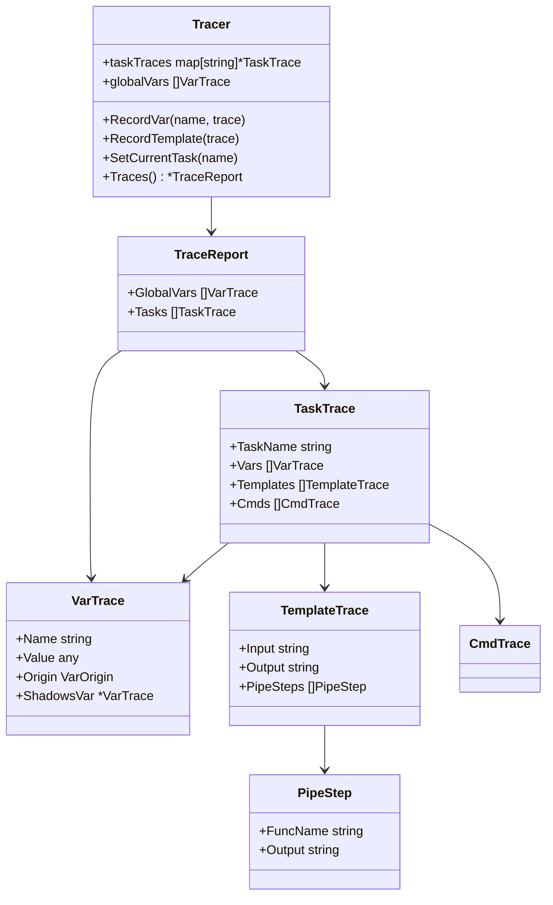

# 03 — Data Model

## Trace Structures

<!-- ✅ CLOSED — All structures implemented in internal/transparent/model.go exactly as specified. -->

All types live in `internal/transparent/model.go`.

### VarTrace

<!-- ✅ CLOSED — All fields implemented including Extra, IsRef, RefName, ValueID, ShCmd. Sorted by origin in output. -->

Captures one variable resolution event.

```Go
VarTrace {
    Name       string       // "MY_VAR"
    Value      any          // resolved value
    RawValue   any          // pre-template-substitution value (if different)
    Origin     VarOrigin    // enum: see below
    Type       string       // Go type: "string", "[]string", "map[string]any"
    IsDynamic  bool         // true if resolved via `sh:`
    ShCmd      string       // shell command (if dynamic)
    Dir        string       // directory context for resolution
    ShadowsVar *VarTrace    // non-nil if this var shadows another from outer scope
    TaskName   string       // "" for global scope

    // Copy-vs-reference identity tracking
    IsRef      bool         // true if defined via `ref:` keyword
    RefName    string       // source variable name (e.g. "LIST" when `ref: LIST`)
    ValueID    uintptr      // reflect pointer for slice/map — 0 for scalars
                            // Two vars with same non-zero ValueID share the same instance.
                            // A copied value (e.g. re-assigned string) gets ValueID=0.

    // Extensibility (future features can attach metadata without changing the struct)
    Extra      map[string]any // nil by default; reserved for plugins/extensions
}
```

### Copy vs Reference Semantics

<!-- ✅ CLOSED — ValueID via reflect.ValueOf().Pointer(); ptr displayed in text and JSON; tested with ref examples. -->

| Scenario                              | `IsRef` | `ValueID`           | Display                                        |
| ------------------------------------- | ------- | ------------------- | ---------------------------------------------- |
| Static scalar: `NAME: "hello"`        | false   | 0                   | `NAME = "hello"`                               |
| Ref to scalar: `ALIAS: { ref: NAME }` | true    | 0                   | `ALIAS = "hello"  ref:NAME  (copy — scalar)`   |
| List value: `ITEMS: [a, b]`           | false   | 0xc000…             | `ITEMS = ["a","b"]  ptr:0xc000…`               |
| Ref to list: `COPY: { ref: ITEMS }`   | true    | 0xc000… (same)      | `COPY = ["a","b"]  ref:ITEMS  ← same instance` |
| Re-assigned list: `OTHER: [a, b]`     | false   | 0xc001… (different) | `OTHER = ["a","b"]  ptr:0xc001…`               |

`ValueID` is obtained via `reflect.ValueOf(v.Value).Pointer()` for types that support it (slices, maps, pointers). For scalar types (string, int, bool) it is always 0 and identity is not applicable — scalars are always copies in Go.

### VarOrigin (enum)

<!-- ✅ CLOSED — All 10 origins implemented: Environment, Special, TaskfileEnv/Vars, Include, Call, Task, ForLoop, Dotenv. -->

```Go
OriginEnvironment          // os environment
OriginSpecial              // TASK, ROOT_DIR, TASK_DIR, etc.
OriginTaskfileEnv          // Taskfile.yml `env:` block
OriginTaskfileVars         // Taskfile.yml `vars:` block
OriginIncludeVars          // `includes:` directive vars
OriginIncludedTaskfileVars // vars from the included Taskfile itself
OriginCallVars             // CLI or call-site vars (FOO=bar)
OriginTaskVars             // task-level `vars:` block
OriginForLoop              // FOR loop iterator (ITEM, KEY)
OriginDotenv               // .env file
```

### TemplateTrace

<!-- ✅ CLOSED — Input, Output, Context, PipeSteps, VarsUsed, Tips fields all implemented and populated. -->

Captures one template evaluation.

```Go
TemplateTrace {
    Input      string            // raw template: "{{printf \"%s\" .NAME | trim}}"
    Output     string            // resolved: "hello"
    Context    string            // where used: "task:build.cmds[0]"
    PipeSteps  []PipeStep        // breakdown of pipe chain
    VarsUsed   []string          // ["NAME"]
    Error      string            // template error if any
}
```

### PipeStep

<!-- ✅ CLOSED — AST-based pipe analysis via pipe_analyzer.go; FuncName, Args extracted from template/parse nodes. -->

Captures one step in a template pipe chain.

```Go
PipeStep {
    FuncName   string   // "printf", "trim"
    Args       []string // ["\"%s\"", ".NAME"]
    ArgsValues []string // ["\"%s\"", "\"hello\""] (resolved)
    Output     string   // intermediate result
}
```

### TaskTrace

<!-- ✅ CLOSED — TaskName, Vars, Templates, Deps, Cmds fields all implemented. -->

Groups all traces for a single task.

```Go
TaskTrace {
    TaskName    string
    Vars        []VarTrace
    Templates   []TemplateTrace
    Deps        []string           // dependency task names
    Cmds        []CmdTrace
}
```

### CmdTrace

<!-- ✅ CLOSED — Index, RawCmd, ResolvedCmd, IterationLabel fields implemented. Templates attached to cmds. -->

```Go
CmdTrace {
    Index      int
    RawCmd     string   // before template substitution
    ResolvedCmd string  // after template substitution
    Templates  []TemplateTrace
}
```

## Relationships

<!-- ✅ CLOSED — Class diagram matches actual implementation; Tracer→TraceReport→TaskTrace→VarTrace/TemplateTrace/CmdTrace. -->


