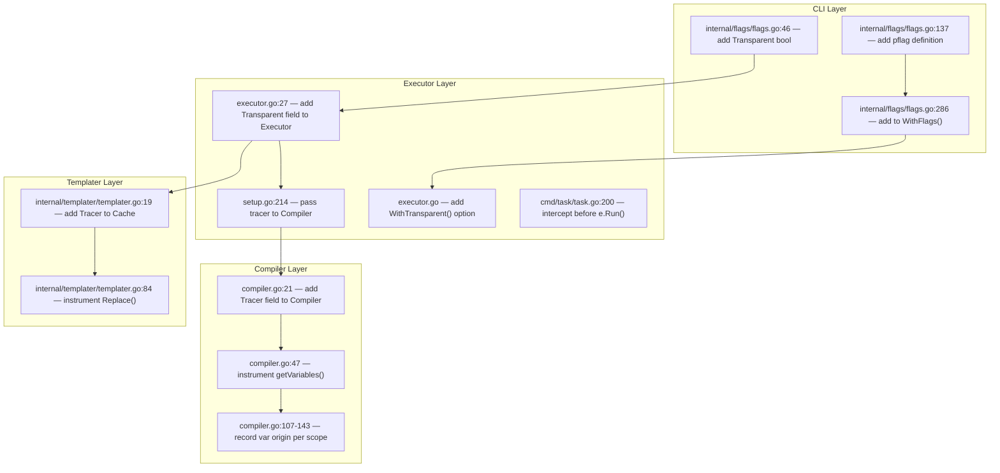
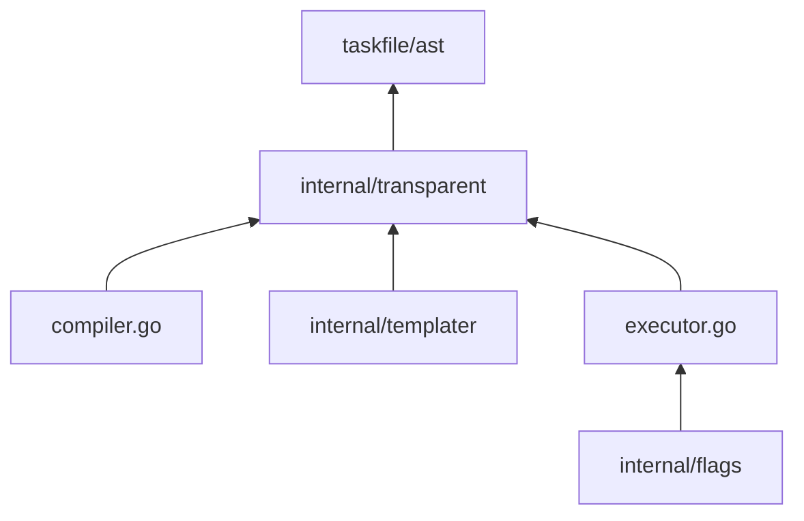

# 04 — Integration Points

## Overview

<!-- ✅ CLOSED — All integration hooks implemented; minimal changes to existing files, optional Tracer pointer pattern. -->

This document specifies **exactly where** in the existing codebase the transparent mode hooks in. Changes are minimal — primarily passing an optional `*Tracer` pointer through existing function signatures and adding a few recording calls.

## Integration Map

<!-- ✅ CLOSED — All integration points wired: flags→executor→compiler→templater with Tracer pointer threading. -->

---

## File-by-File Changes

<!-- ✅ CLOSED — All 7 file modifications implemented as specified; line numbers differ slightly due to organic changes. -->

### 1. `internal/flags/flags.go`

<!-- ✅ CLOSED — Transparent bool field, --transparent/-T pflag, passed to executor via e.Transparent field. -->

| Line | Change           | Detail                                                                                                      |
| ---- | ---------------- | ----------------------------------------------------------------------------------------------------------- |
| 46   | Add field        | `Transparent bool`                                                                                          |
| ~137 | Add pflag        | `pflag.BoolVarP(&Transparent, "transparent", "T", false, "Show template and variable diagnostic overlay.")` |
| 286+ | Pass to executor | Add `task.WithTransparent(Transparent)` in `ApplyToExecutor()`                                              |

### 2. `executor.go`

<!-- ✅ CLOSED — Transparent bool field + Tracer pointer on Executor; set in setup.go. -->

| Line | Change     | Detail                                                                           |
| ---- | ---------- | -------------------------------------------------------------------------------- |
| 27   | Add field  | `Transparent bool` to `Executor` struct                                          |
| new  | Add option | `WithTransparent(bool) ExecutorOption` (follow existing pattern, e.g. `WithDry`) |

### 3. `setup.go` → `setupCompiler()`

<!-- ✅ CLOSED — Creates transparent.NewTracer() when e.Transparent=true; assigns to compiler and templater cache. -->

| Line | Change      | Detail                                                                                 |
| ---- | ----------- | -------------------------------------------------------------------------------------- |
| 223  | Conditional | If `e.Transparent`, create `transparent.NewTracer()` and assign to `e.Compiler.Tracer` |

### 4. `compiler.go`

<!-- ✅ CLOSED — All 8 variable scope loops instrumented with RecordVar() calls for each origin type. -->

| Line    | Change     | Detail                                                                                                 |
| ------- | ---------- | ------------------------------------------------------------------------------------------------------ |
| 21      | Add field  | `Tracer *transparent.Tracer` to `Compiler` struct                                                      |
| 53-55   | Instrument | After setting special vars: `c.Tracer.RecordVar(k, VarTrace{Origin: OriginSpecial, ...})`              |
| 107-111 | Instrument | After TaskfileEnv range: `c.Tracer.RecordVar(k, VarTrace{Origin: OriginTaskfileEnv, ...})`             |
| 112-116 | Instrument | After TaskfileVars range: `c.Tracer.RecordVar(k, VarTrace{Origin: OriginTaskfileVars, ...})`           |
| 118-122 | Instrument | After IncludeVars range: `c.Tracer.RecordVar(k, VarTrace{Origin: OriginIncludeVars, ...})`             |
| 123-127 | Instrument | After IncludedTaskfileVars: `c.Tracer.RecordVar(k, VarTrace{Origin: OriginIncludedTaskfileVars, ...})` |
| 134-138 | Instrument | After Call.Vars: `c.Tracer.RecordVar(k, VarTrace{Origin: OriginCallVars, ...})`                        |
| 139-143 | Instrument | After Task.Vars: `c.Tracer.RecordVar(k, VarTrace{Origin: OriginTaskVars, ...})`                        |
| 187     | Instrument | After dynamic var resolution: `c.Tracer.RecordVar(k, VarTrace{IsDynamic: true, ShCmd: *v.Sh, ...})`    |

### 5. `internal/templater/templater.go`

<!-- ✅ CLOSED — Cache.Tracer field added; RecordTemplate() called with input/output/VarsUsed/PipeSteps/Tips. -->

| Line  | Change     | Detail                                                                                                           |
| ----- | ---------- | ---------------------------------------------------------------------------------------------------------------- |
| 19    | Add field  | `Tracer *transparent.Tracer` to `Cache` struct                                                                   |
| 84-93 | Instrument | Inside `TraverseStringsFunc`: before/after `tpl.Execute()`, record `TemplateTrace{Input: v, Output: b.String()}` |

### 6. `variables.go` → `compiledTask()`

<!-- ✅ CLOSED — Tracer passed to cache; CmdTrace/DepTrace recorded; SetTemplateContext() at each section. -->

| Line    | Change      | Detail                                                             |
| ------- | ----------- | ------------------------------------------------------------------ |
| 101     | Pass tracer | `cache := &templater.Cache{Vars: vars, Tracer: e.Compiler.Tracer}` |
| 204-251 | Instrument  | Record `CmdTrace` for each command (raw vs resolved)               |

### 7. `cmd/task/task.go`

<!-- ✅ CLOSED — Transparent intercept before e.Run(); routes to RunTransparent() or RunTransparentAll(). -->

| Line | Change    | Detail                                                                                                                                                                     |
| ---- | --------- | -------------------------------------------------------------------------------------------------------------------------------------------------------------------------- |
| ~200 | Intercept | Before `e.Run(ctx, calls...)`: if `flags.Transparent` → call `e.RunTransparent(ctx, calls...)` which compiles tasks but renders the diagnostic report instead of executing |

---

## New Files

<!-- ✅ CLOSED — All 4 new files created plus additional: pipe_analyzer.go, renderer_json.go, golden_test.go. -->

| File                               | Purpose                                                                            |
| ---------------------------------- | ---------------------------------------------------------------------------------- |
| `internal/transparent/model.go`    | Trace data structures (see 03-DATA-MODEL.md)                                       |
| `internal/transparent/tracer.go`   | `Tracer` struct with `RecordVar()`, `RecordTemplate()`, `SetCurrentTask()` methods |
| `internal/transparent/renderer.go` | Formats and prints the diagnostic report to stderr                                 |
| `transparent.go` (root package)    | `Executor.RunTransparent()` method — compiles tasks and calls renderer             |

## Dependency Graph (packages)

<!-- ✅ CLOSED — No circular dependencies; internal/transparent depends only on taskfile/ast and text/template/parse. -->

No circular dependencies. `internal/transparent` only depends on `taskfile/ast` for `Var` type references.
