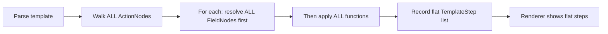
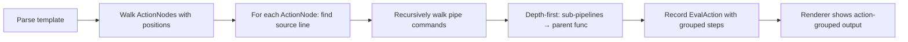

# 11 — Evaluation Steps Redesign — Software Specification

**Version**: 1.0.0
**Created**: 2026-02-12
**Updated**: 2026-02-12

## 🎯 Overview

This specification redesigns the **Evaluation Steps** output of the `--transparent` mode to accurately reflect how Go's `text/template` engine evaluates template expressions. The current implementation has structural inaccuracies in step ordering, lacks source-line awareness for multi-line templates, and produces confusing output for nested pipe expressions.

### What This Changes

- **Groups evaluation steps by action** — each `{{...}}` expression in the template is shown as a distinct action with its own steps
- **Tracks source lines** — shows which line of a multi-line template each action belongs to
- **Correct evaluation order** — follows Go template's real evaluation: resolve args depth-first (including sub-pipelines), then apply the function
- **Shows source and result per action** — users see the line before and after evaluation

### What It Does NOT Change

- The variable table rendering (already improved separately)
- The Input/Output boxes around the evaluation steps
- The PipeStep fallback for simpler templates
- The JSON report version number

---

## 📊 Feature Matrix

| Feature                           | Status | Component          | Notes                                              |
| --------------------------------- | ------ | ------------------ | -------------------------------------------------- |
| Action-grouped steps              | 🔲     | pipe_analyzer.go   | New `EvalAction` struct groups steps per `{{...}}`  |
| Source line tracking              | 🔲     | pipe_analyzer.go   | Uses `parse.Pos` to find line numbers               |
| Correct recursive eval order      | 🔲     | pipe_analyzer.go   | Depth-first: sub-pipelines before parent function   |
| Source/Result lines per action    | 🔲     | renderer.go        | `S` and `R` labels in human-readable output         |
| Short labels (I/O)                | ✅     | renderer.go        | Already implemented                                 |
| Multiline alignment               | ✅     | renderer.go        | Already implemented                                 |
| Whitespace visibility in steps    | ✅     | renderer.go        | Already implemented                                 |
| JSON structure for eval_actions   | 🔲     | renderer_json.go   | Nested JSON mirrors new data model                  |

**Legend**: ✅ Done | 🔲 TODO

---

## 🏗️ Architecture

### Current Flow (Problems)



**Problems:**
1. Steps are flat — no grouping by which `{{...}}` action they belong to
2. All variable resolutions happen before any function applications (wrong order for nested pipes)
3. No source line tracking — `Expression` field shows entire template, not the relevant line
4. For `{{spew (.ENGINE | trim)}}`, the steps show `.ENGINE` resolution, then `trim`, then `spew` — but don't show that `trim` is inside a sub-pipeline argument to `spew`

### New Flow (Correct)



### Evaluation Order for Go Templates

Go's `text/template` evaluates expressions as follows:

1. **For a pipe** `{{cmd1 | cmd2 | cmd3}}`: commands execute left-to-right, each receiving the previous result
2. **For a command** `{{func arg1 arg2}}`: arguments are evaluated left-to-right, then the function is called
3. **For a sub-pipeline** `{{func (expr | pipe)}}`: the parenthesized sub-pipeline is fully evaluated before the outer function
4. **For a field** `{{.VAR}}`: the variable is resolved from the data map

**Example:** `{{printf "%s: %*s %s" "ENGINE" .SPACE (.ENGINE | trim)}}`

```
Evaluation order:
  1. Literal "%s: %*s %s" → "%s: %*s %s"     (no step — literal)
  2. Literal "ENGINE" → "ENGINE"               (no step — literal)
  3. Resolve .SPACE → 20                       (Step: Resolve a Variable)
  4. Sub-pipeline (.ENGINE | trim):
     4a. Resolve .ENGINE → "  node  "          (Step: Resolve a Variable)
     4b. Apply trim("  node  ") → "node"       (Step: Apply a Function)
  5. Apply printf("%s: %*s %s", "ENGINE", 20, "node")  (Step: Apply a Function)
```

---

## 💻 Core Implementation

### Data Model Changes

**New structs** (replace `DetailedSteps []TemplateStep` in `TemplateTrace`):

```go
// EvalAction groups evaluation steps for a single template action (one {{...}} expression).
type EvalAction struct {
    ActionIndex int            `json:"action_index"`          // 0-based index among actions
    SourceLine  int            `json:"source_line"`           // 1-based line number in template
    Source      string         `json:"source"`                // The source line text
    Result      string         `json:"result"`                // The line after this action is resolved
    Steps       []TemplateStep `json:"steps"`                 // Steps within this action
}
```

**Modified `TemplateStep`** (remove `Expression` field, it's replaced by action-level `Source`/`Result`):

```go
type TemplateStep struct {
    StepNum   int    `json:"step"`           // Sequential number (1-based, global across all actions)
    Operation string `json:"operation"`      // "Resolve a Variable" or "Apply a Function"
    Target    string `json:"target"`         // Variable name (.NAME) or function name (trim)
    Input     string `json:"input"`          // Input value(s) for this step
    Output    string `json:"output"`         // Output value
}
```

**Modified `TemplateTrace`**:

```go
type TemplateTrace struct {
    Input       string       `json:"input"`
    Output      string       `json:"output"`
    Context     string       `json:"context"`
    Steps       []PipeStep   `json:"pipe_steps,omitempty"`
    EvalActions []EvalAction `json:"eval_actions,omitempty"`  // NEW: replaces DetailedSteps
    Tips        []string     `json:"tips,omitempty"`
    VarsUsed    []string     `json:"vars_used,omitempty"`
    Error       string       `json:"error,omitempty"`
}
```

### New `AnalyzeEvalActions` Function

Replaces `AnalyzeDetailedSteps`. Key algorithm:

```go
func AnalyzeEvalActions(input string, data map[string]any, funcs template.FuncMap) []EvalAction {
    // 1. Parse template
    // 2. Split input into lines for source line lookup
    // 3. For each ActionNode:
    //    a. Compute line number from node.Pos
    //    b. Extract source line text
    //    c. Walk the pipe recursively to generate steps
    //    d. Evaluate the action to get the result
    //    e. Build the result line (source line with {{...}} replaced by result)
    // 4. Return list of EvalActions
}
```

**Recursive pipe walking:**

```go
func walkPipe(pipe *parse.PipeNode, data map[string]any, funcs template.FuncMap,
              stepCounter *int) []TemplateStep {
    var steps []TemplateStep
    for _, cmd := range pipe.Cmds {
        // Process each argument first (depth-first)
        for _, arg := range cmd.Args[1:] {
            if subPipe, ok := arg.(*parse.PipeNode); ok {
                // Recursively walk sub-pipeline
                steps = append(steps, walkPipe(subPipe, data, funcs, stepCounter)...)
            } else if field, ok := arg.(*parse.FieldNode); ok {
                // Resolve variable
                *stepCounter++
                steps = append(steps, TemplateStep{
                    StepNum:   *stepCounter,
                    Operation: "Resolve a Variable",
                    Target:    field.String(),
                    Input:     resolveNodeValue(arg, data),
                })
            }
        }
        // Then record the function application (if first arg is identifier)
        if ident, ok := cmd.Args[0].(*parse.IdentifierNode); ok {
            *stepCounter++
            steps = append(steps, TemplateStep{
                StepNum:   *stepCounter,
                Operation: "Apply a Function",
                Target:    ident.Ident,
                Input:     buildFuncInput(cmd, data),
                Output:    evalPartial(...),
            })
        } else if field, ok := cmd.Args[0].(*parse.FieldNode); ok {
            // Variable access as first command in pipe
            *stepCounter++
            steps = append(steps, TemplateStep{
                StepNum:   *stepCounter,
                Operation: "Resolve a Variable",
                Target:    field.String(),
                Input:     resolveNodeValue(cmd.Args[0], data),
            })
        }
    }
    return steps
}
```

### Source Line Computation

```go
func lineNumber(input string, pos parse.Pos) int {
    return strings.Count(input[:int(pos)], "\n") + 1
}

func sourceLine(input string, lineNum int) string {
    lines := strings.Split(input, "\n")
    if lineNum >= 1 && lineNum <= len(lines) {
        return lines[lineNum-1]
    }
    return ""
}
```

---

## 🚀 Usage

### Human-Readable Output Format

Given this multi-line template (from `cmds[0]` of the `debug` task):

```
echo ":: Global Taskfile variables ::"
echo ""
echo "{{spew (.ENGINE | trim)}}"
echo '{{printf "%s: %*s %s" "ENGINE" .SPACE (.ENGINE | trim)}}'
```

The `--transparent` output for Evaluation Steps:

```
  ┌─ Evaluation Steps:
  │
  │ ── Action 1 of 2 — line 3
  │ S     echo "{{spew (.ENGINE | trim)}}"
  │
  │ Step 1: Resolve a Variable — .ENGINE
  │   I     node
  │ Step 2: Apply a Function — trim
  │   I     trim node
  │   O     node
  │ Step 3: Apply a Function — spew
  │   I     spew node
  │   O     (string) (len=4) "node"
  │
  │ R     echo "(string) (len=4) "node""
  │
  │ ── Action 2 of 2 — line 4
  │ S     echo '{{printf "%s: %*s %s" "ENGINE" .SPACE (.ENGINE | trim)}}'
  │
  │ Step 4: Resolve a Variable — .SPACE
  │   I     20
  │ Step 5: Resolve a Variable — .ENGINE
  │   I     node
  │ Step 6: Apply a Function — trim
  │   I     trim node
  │   O     node
  │ Step 7: Apply a Function — printf
  │   I     printf "%s: %*s %s" "ENGINE" 20 "node"
  │   O     ENGINE:                 node %!s(MISSING)
  │
  │ R     echo 'ENGINE:                 node %!s(MISSING)'
  │
  └─
```

**Label meanings:**
- `S` = **Source** — the template line before evaluation (shows the `{{...}}` expression)
- `R` = **Result** — the template line after evaluation (shows the resolved value)
- `I` = **Input** — input to the step
- `O` = **Output** — output of the step

**Formatting rules:**
- Action headers use `── Action N of M — line L` format with dim color
- `S` and `R` lines use bold color for emphasis
- Step headers use the existing `Step N: Operation — Target` format
- `I`/`O` lines are indented 2 spaces past the label, aligned at column 8
- With `--show-whitespaces`: spaces → `·`, tabs → `→` in I/O/S/R content
- No trailing blank lines before `└─`

### JSON Output Format

```json
{
  "eval_actions": [
    {
      "action_index": 0,
      "source_line": 3,
      "source": "echo \"{{spew (.ENGINE | trim)}}\"",
      "result": "echo \"(string) (len=4) \\\"node\\\"\"",
      "steps": [
        {
          "step": 1,
          "operation": "Resolve a Variable",
          "target": ".ENGINE",
          "input": "node",
          "output": ""
        },
        {
          "step": 2,
          "operation": "Apply a Function",
          "target": "trim",
          "input": "trim node",
          "output": "node"
        },
        {
          "step": 3,
          "operation": "Apply a Function",
          "target": "spew",
          "input": "spew node",
          "output": "(string) (len=4) \"node\""
        }
      ]
    },
    {
      "action_index": 1,
      "source_line": 4,
      "source": "echo '{{printf \"%s: %*s %s\" \"ENGINE\" .SPACE (.ENGINE | trim)}}'",
      "result": "echo 'ENGINE:                 node %!s(MISSING)'",
      "steps": [
        {
          "step": 4,
          "operation": "Resolve a Variable",
          "target": ".SPACE",
          "input": "20",
          "output": ""
        },
        {
          "step": 5,
          "operation": "Resolve a Variable",
          "target": ".ENGINE",
          "input": "node",
          "output": ""
        },
        {
          "step": 6,
          "operation": "Apply a Function",
          "target": "trim",
          "input": "trim node",
          "output": "node"
        },
        {
          "step": 7,
          "operation": "Apply a Function",
          "target": "printf",
          "input": "printf \"%s: %*s %s\" \"ENGINE\" 20 \"node\"",
          "output": "ENGINE:                 node %!s(MISSING)"
        }
      ]
    }
  ]
}
```

### Single-Line Template (Simple Case)

For `echo '{{.NAME | trim | upper}}'` (single action, single line):

```
  ┌─ Evaluation Steps:
  │
  │ ── Action 1 of 1 — line 1
  │ S     echo '{{.NAME | trim | upper}}'
  │
  │ Step 1: Resolve a Variable — .NAME
  │   I       world
  │ Step 2: Apply a Function — trim
  │   I     trim   world
  │   O     world
  │ Step 3: Apply a Function — upper
  │   I     upper world
  │   O     WORLD
  │
  │ R     echo 'WORLD'
  │
  └─
```

---

## 📐 Design Decisions

### ADR-001: Group Steps by Action Node

**Context**: The current flat list of steps doesn't show which `{{...}}` expression each step belongs to.

**Decision**: Group steps into `EvalAction` structs, one per ActionNode in the template AST.

**Rationale**:
- **Clarity**: Users immediately see which template expression is being evaluated
- **Source context**: Each action shows the source line and result line
- **Multi-line support**: Multi-line templates are broken down action by action
- **Correct ordering**: Steps within an action follow the real evaluation order

**Consequences**:
- ✅ Much clearer output for multi-line templates
- ✅ Users can correlate steps with specific `{{...}}` expressions
- ⚠️ Breaking change to `TemplateTrace` struct (replaces `DetailedSteps` with `EvalActions`)
- ⚠️ JSON output structure changes

### ADR-002: Remove Expression Field from TemplateStep

**Context**: The `Expression` field in `TemplateStep` showed the full template state after each step, which was confusing for multi-line templates.

**Decision**: Replace it with `Source` and `Result` fields at the `EvalAction` level.

**Rationale**:
- The full template evolving step-by-step is verbose and hard to read
- What users really need is: "this line went in, this line came out"
- Action-level Source/Result is clearer than per-step Expression

### ADR-003: Recursive Pipe Walking for Correct Order

**Context**: The current code resolves all variables first, then applies all functions, which is wrong for nested sub-pipelines.

**Decision**: Walk the AST recursively, processing sub-pipelines depth-first before the parent function.

**Rationale**:
- Matches Go template engine's actual evaluation order
- Correctly handles `{{func (expr | pipe)}}` — the sub-pipeline is fully evaluated before `func`
- Handles arbitrarily nested expressions

### ADR-004: Source Line from parse.Pos

**Context**: Need to know which line of a multi-line template each `{{...}}` action belongs to.

**Decision**: Use `ActionNode.Position()` (byte offset) to compute the 1-based line number by counting newlines.

**Rationale**:
- `parse.Pos` is the standard way Go's template parser tracks position
- Simple and reliable: `strings.Count(input[:pos], "\n") + 1`
- No need for external line-mapping data structures

---

## ⚠️ Requirements

### Backward Compatibility

- The `TemplateTrace.Steps` field (`[]PipeStep`) is **preserved** for backward compatibility
- The `TemplateTrace.DetailedSteps` field is **removed** and replaced by `EvalActions`
- JSON key changes from `"detailed_steps"` to `"eval_actions"`
- Human-readable output changes layout but keeps the same box structure

### Edge Cases

| Case                                     | Handling                                              |
| ---------------------------------------- | ----------------------------------------------------- |
| No template actions (plain text)         | `EvalActions` is empty; no Evaluation Steps box shown |
| Single action, single line               | One EvalAction with source_line=1                     |
| Multiple actions on same line            | Multiple EvalActions with same source_line            |
| Nested sub-pipelines `(expr \| pipe)`    | Steps shown depth-first within parent action          |
| Template parse error                     | EvalActions is nil; error recorded in TemplateTrace   |
| Variable not found (`<no value>`)        | Step shows empty string as resolved value             |
| Multi-line template with mixed text/tmpl | Only lines with `{{...}}` get EvalAction entries      |
